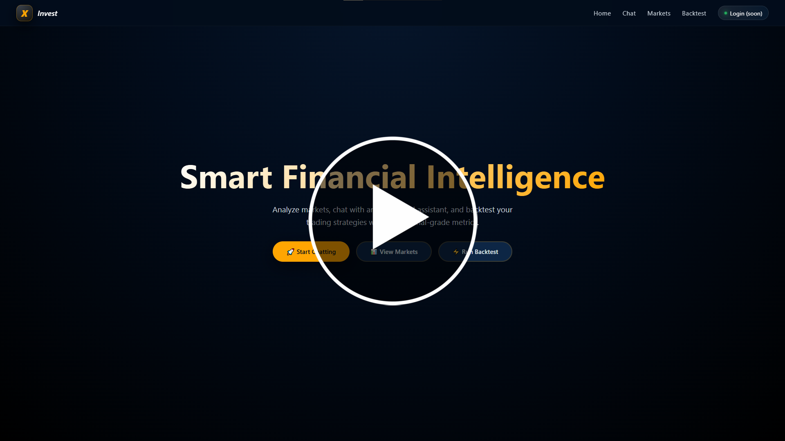
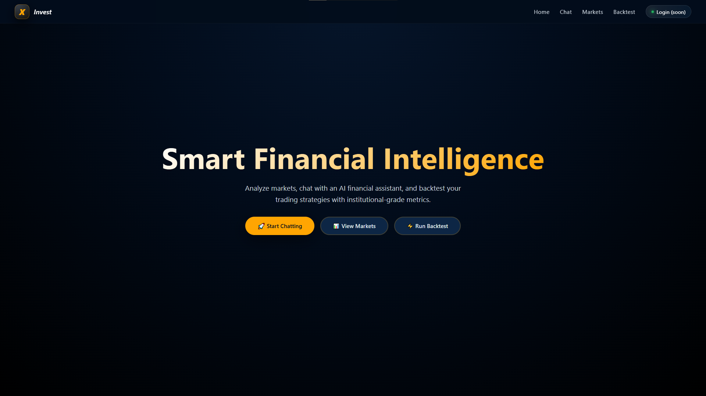
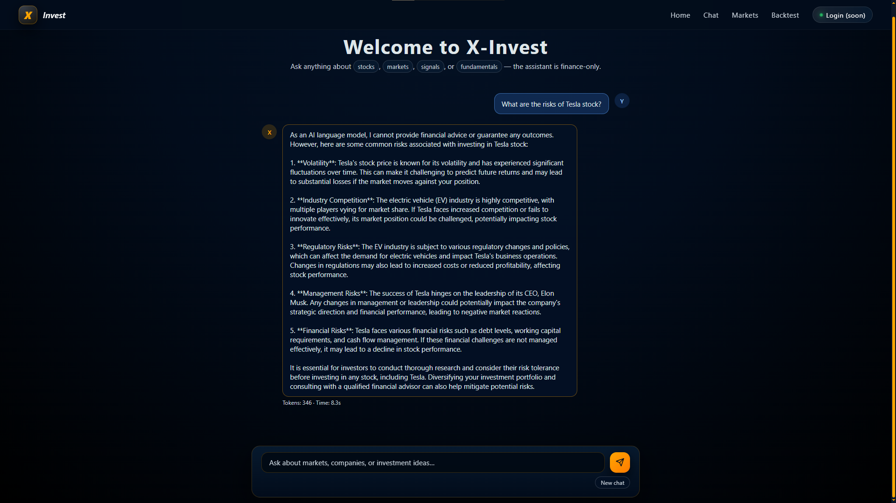
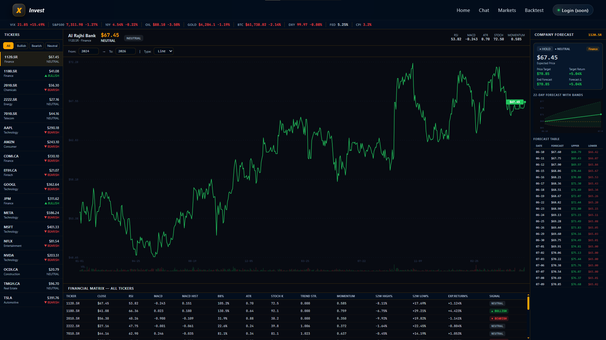
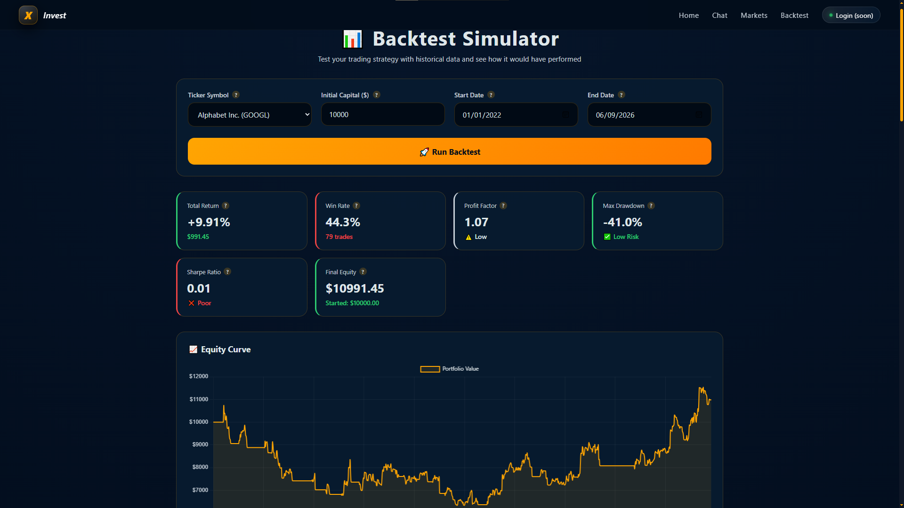
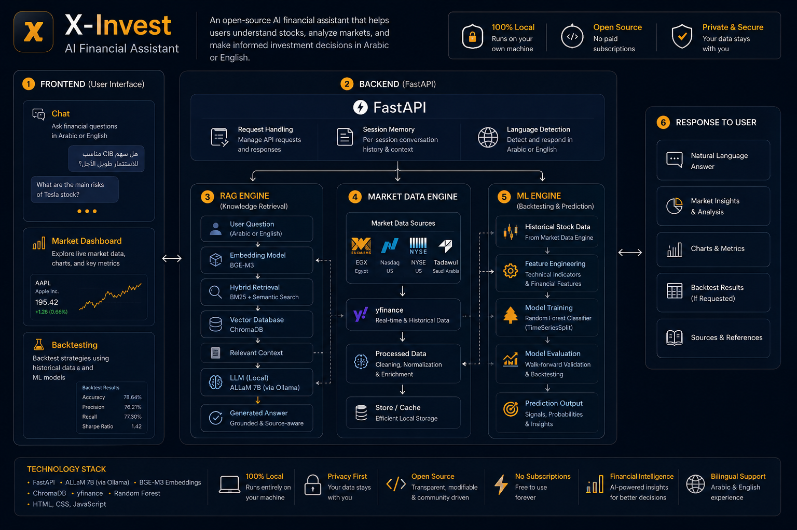

# X-Invest — AI Financial Assistant & Backtest Simulator

> An open-source, educational AI chatbot and trading strategy backtest simulator for stock market research.
> Answers finance questions in **Arabic and English**, retrieves **live market data**, explains financial concepts grounded in a document knowledge base, and simulates algorithmic trading strategies.


---

## Video Demo (Click to Play) ▶

<!-- ============================================================
     DEMO VIDEO
     Replace the line below with your actual video embed.

     Option A — YouTube (recommended):
       [](https://www.youtube.com/watch?v=NaQNVRCQ0o4)

     Option B — GitHub-hosted MP4 (drag the file into any Issue to get a URL):
       https://user-images.githubusercontent.com/YOUR_USER_ID/YOUR_VIDEO_URL.mp4

     Option C — Simple link until you record a video:
       [▶ Watch Demo](https://www.youtube.com/watch?v=YOUR_VIDEO_ID)
     ============================================================ -->

[](https://www.youtube.com/watch?v=NaQNVRCQ0o4)

---

## Screenshots

### 🏠 Home — Landing Page
<!-- Replace the path below with your actual screenshot after uploading to docs/assets/ -->


---

### 💬 Chat — AI Financial Assistant
<!-- Ideally show an Arabic query with a streamed response and live stock data visible -->


---

### 📊 Markets — Live Dashboard
<!-- Show the three-panel layout: company list + chart + financial matrix -->


---

### 📈 Backtest Simulator
<!-- Show the equity curve chart, trade ledger, and metrics panel -->


---

### 🗂️ System Architecture
<!-- The architecture diagram — export from your architecture.html as a PNG -->


---

## What is X-Invest?

X-Invest is a vertical AI assistant scoped entirely to the finance domain (it contextually refuses non-finance queries). Built as a university graduation project, it is designed to run fully locally on consumer hardware.

It is **not** a financial advisor (disclaimers are automatically enforced in all responses). The goal is education: helping users understand stocks, financial metrics, RAG-grounded investment concepts, and simulated trading performance.

---

## Key Features

- **Bilingual Chat** — responds in the language of the user's query (Arabic or English)
- **Live Stock Data** — automatically extracts stock tickers and pulls live prices, P/E, 52-week ranges, and news via `yfinance`
- **RAG Pipeline** — hybrid BM25 + semantic search over your local document knowledge base (CFA guides, books, etc.) using ChromaDB
- **Markets Dashboard** — browse 19 curated US and Middle Eastern companies (NASDAQ, NYSE, EGX, Tadawul) with an instant-load live data panel
- **Preloading Caching Layer** — parallel macro downloads and launch-time pre-caching for fast Markets dashboard loads
- **Backtest Simulator** — test strategy performance on historical data with equity charts, drawdown calculations, and a trade ledger
- **ML Signal Engine** — Random Forest + XGBoost ensemble predicting 5-day forward return directions (Bullish, Bearish, or Neutral)
- **Sentiment Analysis** — combined VADER + FinBERT layer for financial news sentiment scoring

---

## Quick Start

Get the web app running in a few minutes.

### 1. Prerequisites

| Requirement | Notes |
|---|---|
| **Python 3.12+** | [python.org](https://www.python.org/downloads/) |
| **Git** | To clone the repository |
| **Ollama** | [ollama.com](https://ollama.com) — runs the LLM and embeddings locally |

### 2. Clone and install

```bash
git clone https://github.com/Doom4444/X-Invest.git
cd X-Invest

# Create a virtual environment
python -m venv .venv

# Activate it
# Windows (PowerShell):  .venv\Scripts\Activate.ps1
# Windows (cmd):         .venv\Scripts\activate.bat
# macOS / Linux:         source .venv/bin/activate

pip install -r requirements.txt
```

### 3. Pull Ollama models

```bash
ollama pull iKhalid/ALLaM:7b
ollama pull bge-m3:latest
```

### 4. Configure environment

```bash
# Windows
copy .env.example .env

# macOS / Linux
cp .env.example .env
```

The defaults work out of the box for a local Ollama install.

### 5. Run the app

```bash
uvicorn main:app --reload
```

Open **http://localhost:8000**. On first startup, the server pre-warms market data (~10 seconds) before showing `Application startup complete`.

| Page | URL |
|---|---|
| Home | http://localhost:8000 |
| Chat | http://localhost:8000/chat |
| Markets | http://localhost:8000/market |
| Backtest | http://localhost:8000/backtest |
| API docs | http://localhost:8000/docs |

---

## Setup Profiles

### Profile A — Chat & Markets only (fastest)

No ML training or document ingest needed. Works immediately after Quick Start.

**Works:** bilingual chat, live yfinance data, Markets dashboard.
**Limited:** no document-grounded answers, no ML signals or backtest.

### Profile B — Full local (recommended)

1. Complete Quick Start.
2. Add finance documents to `data/documents/` (`.pdf`, `.docx`, `.txt`, `.md`).
3. Run ingest:
   ```bash
   python -m rag.preprocessing.ingest
   ```
4. Train prediction models:
   ```bash
   python prediction/train.py
   ```
5. Start the server: `uvicorn main:app --reload`

### Profile C — Remote Ollama server

Edit `.env`:
```env
OLLAMA_URL=http://192.168.1.50:11434
```
Pull models on the **remote** host. Ensure port `11434` is reachable.

### Profile D — Alternative LLM or embedding model

```env
MODEL_NAME=llama3.2:latest
EMBED_MODEL=bge-m3:latest
```
Re-run ingest after changing `EMBED_MODEL`.

### Profile E — Low-memory hardware

```env
NUM_CTX=2048
MAX_HISTORY=6
TEMPERATURE=0.2
```

### Profile F — Optional external API keys

| Variable | Used by | Get a key |
|---|---|---|
| `FINNHUB_API_KEY` | News fetcher, market fetcher | [finnhub.io](https://finnhub.io) |
| `TWELVEDATA_API_KEY` | Market fetcher | [twelvedata.com](https://twelvedata.com) |
| `NEWS_API_KEY` | Sentiment module | [newsapi.org](https://newsapi.org) |
| `HF_TOKEN` | FinBERT / Hugging Face downloads | [huggingface.co/settings/tokens](https://huggingface.co/settings/tokens) |

---

## Configuration

All settings are loaded from `.env` by `config.py`. Restart the server after any change.

| Variable | Default | Description |
|---|---|---|
| `OLLAMA_URL` | `http://localhost:11434` | Ollama API base URL |
| `MODEL_NAME` | `iKhalid/ALLaM:7b` | Chat model |
| `EMBED_MODEL` | `bge-m3:latest` | Embedding model |
| `NUM_CTX` | `4096` | Context window (tokens) |
| `TEMPERATURE` | `0.3` | Sampling temperature |
| `MAX_HISTORY` | `10` | Max conversation turn pairs |
| `CHROMA_PATH` | `./db/chroma` | ChromaDB storage directory |
| `COLLECTION_NAME` | `finance_concepts` | Chroma collection name |
| `PROMPTS_DIR` | `./prompts` | System prompt directory |
| `DOCS_PATH` | `./data/documents` | Knowledge base document folder |

---

## Tech Stack

| Layer | Technology |
|---|---|
| **Backend** | Python 3.12+, FastAPI, Uvicorn |
| **LLM** | ALLaM 7B via Ollama (Arabic-first, local) |
| **Embeddings** | BGE-M3 via Ollama |
| **Vector Database** | ChromaDB (persistent local) |
| **Retrieval** | Hybrid BM25 + semantic (rank-bm25) |
| **Market Data** | yfinance |
| **ML — Signal** | Random Forest + XGBoost ensemble |
| **ML — Sentiment** | VADER + FinBERT combined layer |
| **Frontend** | HTML5, Vanilla CSS/JS, Chart.js, Jinja2 |

No LangChain. No paid LLM API keys required for core functionality.

---

## Project Structure

```
X-Invest/
├── main.py                     # FastAPI entry point & page routing
├── config.py                   # Settings loaded from .env
├── requirements.txt
├── .env.example
│
├── api/                        # HTTP endpoints
│   ├── chat.py                 # Streaming chat
│   ├── market.py               # Markets dashboard
│   ├── signal.py               # ML signal badge
│   └── backtest_api.py         # Backtest simulation
│
├── pipeline/                   # Chat context & response pipeline
├── services/llm_service.py     # Ollama chat + stream wrappers
│
├── rag/
│   ├── core/                   # Embeddings, ChromaDB, hybrid retriever
│   ├── preprocessing/          # Document ingest
│   └── online/                 # Live market & news fetchers
│
├── market/                     # Dashboard feeds & curated tickers
├── prediction/                 # ML training, signals, backtest engine
│
├── templates/                  # Jinja2 HTML pages
├── static/                     # CSS, JS, images
├── prompts/                    # System prompt
├── db/                         # ChromaDB + caches (created at runtime)
├── data/documents/             # Your PDF/DOCX/TXT knowledge-base files
│
└── docs/
    └── assets/                 # Screenshots and architecture diagram
        ├── screenshot-home.png
        ├── screenshot-chat.png
        ├── screenshot-market.png
        ├── screenshot-backtest.png
        ├── architecture.png
        └── demo-thumbnail.png
```

---

## Optional Setup Steps

### Ingest documents (RAG knowledge base)

1. Place files in `data/documents/`.
2. Run: `python -m rag.preprocessing.ingest`
3. Re-run after adding or replacing documents.

### Train prediction models

```bash
python prediction/train.py
```

Saves classifiers under `prediction/saved_models/`. Required for the Backtest page and ML signals in chat.

### Command-line backtest

```bash
python prediction/backtest.py
```

Prompts for ticker, date range, and starting capital. Prints Sharpe, drawdown, win rate, and saves an equity chart.

---

## API Reference

| Method | Endpoint | Description |
|---|---|---|
| `POST` | `/api/chat/stream` | Streaming chat (NDJSON) |
| `POST` | `/api/chat` | Blocking chat (JSON) |
| `POST` | `/api/clear` | Clear session memory |
| `GET` | `/api/market/dashboard` | Cached macro strip + company matrix |
| `GET` | `/api/market/{ticker}/history` | Price history for charts |
| `GET` | `/api/signal/{ticker}` | ML direction signal |
| `POST` | `/api/backtest` | Run strategy simulation |

Interactive docs: **http://localhost:8000/docs**

<details>
<summary><strong>Example: POST /api/backtest</strong></summary>

Request:
```json
{
  "ticker": "AAPL",
  "initial_capital": 10000.0,
  "start": "2024-01-01"
}
```

Response:
```json
{
  "success": true,
  "equity": [10000.0, 10050.2, 10210.5],
  "trades": [{ "entry": "...", "exit": "...", "pnl": 421.2 }],
  "metrics": {
    "total_return": 0.238555,
    "sharpe": 0.41,
    "win_rate": 0.6216,
    "max_drawdown": -0.29316
  }
}
```

</details>

---

## Troubleshooting

| Problem | What to try |
|---|---|
| **Connection refused to Ollama** | Confirm Ollama is running (`ollama list`). Check `OLLAMA_URL` in `.env`. |
| **Model not found** | `ollama pull <MODEL_NAME>` and `ollama pull <EMBED_MODEL>`. |
| **Chat works but no document answers** | Run ingest; verify files exist under `DOCS_PATH`. |
| **Backtest / signals unavailable** | Run `python prediction/train.py` and check `prediction/saved_models/`. |
| **Slow first load on Markets** | Normal on cold start — pre-warm takes ~10s. Subsequent loads use cache. |
| **Unicode errors on Windows** | Use PowerShell or Windows Terminal. |
| **Changed embedding model** | Re-run `python -m rag.preprocessing.ingest` so vectors match. |

---

## Disclaimer

X-Invest is an educational project and does not offer professional investment advice. All AI responses include an automated disclaimer. Always consult a certified financial planner before making real investment decisions.

---

## License

MIT License. Free to use, modify, and build upon.
