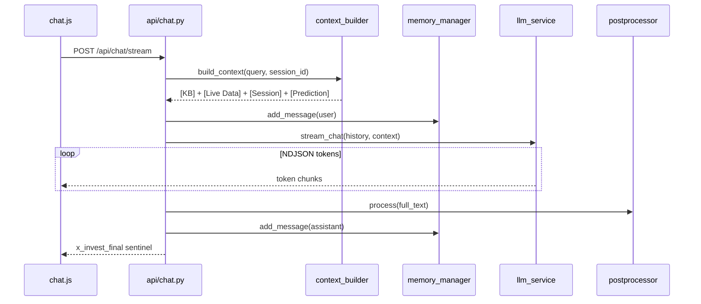

# X-Invest — Technical Documentation

**Version:** Phase 2 (Chat · Markets · Backtest · ML Signals)  
**Project:** BIS Graduation Project — Egypt, July 2026  
**Stack:** Python · FastAPI · Ollama · ChromaDB · yfinance · scikit-learn · XGBoost

---

## Table of Contents

1. [Project Overview](#1-project-overview)
2. [Architecture at a Glance](#2-architecture-at-a-glance)
3. [Tech Stack & Dependencies](#3-tech-stack--dependencies)
4. [Project Structure](#4-project-structure)
5. [Configuration](#5-configuration)
6. [Application Bootstrap](#6-application-bootstrap)
7. [Chat Pipeline — End to End](#7-chat-pipeline--end-to-end)
8. [RAG Knowledge Base](#8-rag-knowledge-base)
9. [Markets Dashboard](#9-markets-dashboard)
10. [Prediction & Signal Engine](#10-prediction--signal-engine)
11. [Backtest Simulator](#11-backtest-simulator)
12. [Frontend Pages & Scripts](#12-frontend-pages--scripts)
13. [API Reference](#13-api-reference)
14. [Module Reference](#14-module-reference)
15. [Operational Notes](#15-operational-notes)
16. [Future Work](#16-future-work)

---

## 1. Project Overview

X-Invest is a **vertical AI financial assistant** — intentionally scoped to finance only. It is built from scratch without LangChain or similar frameworks so every layer is transparent and debuggable.

The system has four major capabilities:

| Capability | Description |
|---|---|
| **Bilingual Chat** | Arabic/English Q&A grounded in documents, live prices, and ML signals |
| **Markets Dashboard** | Curated US, EGX, and Tadawul tickers with macro strip and technical matrix |
| **ML Signal Engine** | Random Forest + XGBoost ensemble predicting 5-day return direction |
| **Backtest Simulator** | Web and CLI strategy simulation with equity curves and trade ledger |

### Design principles

**Vertical (finance-only)**
- `prompts/system_prompt.txt` instructs the model to refuse non-finance topics
- `pipeline/postprocessor.py` enforces a disclaimer on every response
- The RAG knowledge base contains only finance documents

**Grounded (no hallucinated numbers)**
- Context is assembled from: static KB, live yfinance data, session memory, and prediction signals
- The system prompt forbids inventing prices or metrics

**Local-first**
- LLM (ALLaM 7B) and embeddings run via Ollama on the host machine
- ChromaDB stores vectors on disk at `db/chroma/`
- No OpenAI or paid API keys are required for core chat functionality

**Educational disclaimer**
- All outputs are for learning, not professional investment advice

---

## 2. Architecture at a Glance

```
Browser (HTML / CSS / Vanilla JS / Chart.js)
    │
    │  GET  /  /chat  /market  /backtest          ← page loads
    │  POST /api/chat/stream                      ← streaming chat
    │  POST /api/clear                           ← new chat
    │  GET  /api/market/dashboard                ← cached macro + ticker matrix
    │  GET  /api/market/{ticker}/history         ← price chart data
    │  GET  /api/market/{ticker}/forecast        ← forecast panel
    │  GET  /api/signal/{ticker}                 ← ML signal badge
    │  POST /api/backtest                        ← strategy simulation
    │
FastAPI  (main.py)
    │
    ├── api/chat.py
    │     ├── pipeline/context_builder.py
    │     │     ├── rag/core/retriever.py       ← hybrid BM25 + semantic
    │     │     ├── pipeline/entity_extractor.py
    │     │     ├── pipeline/data_fetcher.py    ← yfinance
    │     │     ├── pipeline/online_rag.py      ← per-session live data
    │     │     └── prediction/signal_engine.py
    │     ├── pipeline/memory_manager.py
    │     ├── services/llm_service.py         ← Ollama
    │     └── pipeline/postprocessor.py
    │
    ├── api/market.py
    │     ├── market/companies.py
    │     ├── market/dashboard.py
    │     └── market/dashboard_feed.py          ← parallel fetch + cache
    │
    ├── api/signal.py
    │     └── prediction/signal_engine.py
    │
    └── api/backtest_api.py
          └── prediction/backtest.py            ← BacktestEngine
```

### Chat request flow (simplified)



---

## 3. Tech Stack & Dependencies

| Layer | Technology |
|---|---|
| **Runtime** | Python 3.12+ |
| **Web server** | FastAPI 0.136, Uvicorn, Starlette |
| **Templates** | Jinja2 |
| **LLM & embeddings** | Ollama (`iKhalid/ALLaM:7b`, `nomic-embed-text:latest`) |
| **Vector store** | ChromaDB (cosine HNSW) |
| **Lexical retrieval** | rank-bm25 (hybrid reranking) |
| **Market data** | yfinance |
| **ML** | scikit-learn, XGBoost, pandas, numpy, scipy |
| **Sentiment** | VADER (optional, via `prediction/Sentiment.py`) |
| **Documents** | pypdf, pdfplumber, python-docx |
| **Charts** | Chart.js (frontend), matplotlib (CLI backtest) |
| **Frontend** | Vanilla HTML/CSS/JS — no React or build step |

See `requirements.txt` for pinned versions.

---

## 4. Project Structure

```
X-Invest/
│
├── main.py                         # FastAPI entry, page routes, startup cache warmup
├── config.py                       # Single source of truth for .env settings
├── requirements.txt
├── .env.example
│
├── api/                            # HTTP routers
│   ├── chat.py                     # /api/chat, /api/chat/stream, /api/clear
│   ├── market.py                   # Markets dashboard endpoints
│   ├── signal.py                   # /api/signal/{ticker}
│   └── backtest_api.py             # POST /api/backtest
│
├── pipeline/                       # Chat context & response pipeline
│   ├── context_builder.py          # Orchestrates all context sources
│   ├── memory_manager.py           # In-memory per-session history
│   ├── entity_extractor.py         # Bilingual ticker detection
│   ├── data_fetcher.py             # yfinance → LLM context
│   ├── online_rag.py               # Volatile session-scoped live data
│   └── postprocessor.py            # Disclaimer enforcement
│
├── services/
│   └── llm_service.py              # Ollama chat + stream wrappers
│
├── rag/
│   ├── core/                       # Active RAG stack (used by chat)
│   │   ├── embeddings.py           # Ollama embedding model
│   │   ├── vector_store.py         # ChromaDB wrapper
│   │   ├── retriever.py            # Hybrid BM25 + semantic retrieval
│   │   ├── rag_engine.py           # Retrieve + build context helper
│   │   ├── context_fusion.py       # Multi-source context merger
│   │   └── forecast_engine.py      # Forecast context builder
│   ├── preprocessing/              # Offline document ingest
│   │   ├── ingest.py               # python -m rag.preprocessing.ingest
│   │   └── utils.py                # Loaders, chunking, cleaning
│   ├── online/                     # Live market + news fetchers
│   │   ├── asset_extractor.py
│   │   ├── market_fetcher.py
│   │   ├── market_verifier.py
│   │   ├── news_fetcher.py
│   │   └── news_analyzer.py
│   └── ai/                         # Advanced router (not wired to main chat yet)
│       ├── router.py
│       ├── query_analyzer.py
│       └── llm_engine.py
│
├── market/
│   ├── companies.py                # 19 curated tickers (US, EGX, Tadawul)
│   ├── dashboard.py                # Single-ticker yfinance snapshot
│   └── dashboard_feed.py           # Macro strip, matrix, cache, forecasts
│
├── prediction/
│   ├── train.py                    # Feature engineering + model training
│   ├── predict.py                  # Live inference + forecast series
│   ├── signal_engine.py            # Public get_signal() contract
│   ├── backtest.py                 # BacktestEngine + CLI
│   ├── Data.py                     # FinancialDataCollector
│   ├── Sentiment.py                # Optional sentiment features
│   └── saved_models/               # signal_model.pkl (created by train.py)
│
├── models/
│   └── schemas.py                  # Pydantic request/response models
│
├── templates/                      # Jinja2 pages
│   ├── index.html
│   ├── chat.html
│   ├── market.html
│   └── backtest.html
│
├── static/
│   ├── css/style.css
│   └── js/                         # chat.js, market.js, backtest.js, chart.js, …
│
├── prompts/
│   └── system_prompt.txt
│
├── future/                         # Post-MVP stubs (auth, DB, upload)
│
├── db/chroma/                      # ChromaDB persistence (created at runtime)
└── data/documents/                 # Source PDFs/DOCX/TXT for RAG ingest
```

---

## 5. Configuration

All settings live in `.env` and are loaded once by `config.py`. No other module calls `os.getenv()` directly.

| Variable | Default | Purpose |
|---|---|---|
| `OLLAMA_URL` | `http://localhost:11434` | Ollama API base URL |
| `MODEL_NAME` | `iKhalid/ALLaM:7b` | Chat model |
| `EMBED_MODEL` | `nomic-embed-text:latest` | Embedding model for ChromaDB |
| `NUM_CTX` | `4096` | Ollama context window |
| `TEMPERATURE` | `0.3` | Sampling temperature |
| `MAX_HISTORY` | `10` | Max conversation turns kept in memory |
| `CHROMA_PATH` | `./db/chroma` | ChromaDB directory |
| `COLLECTION_NAME` | `finance_concepts` | Chroma collection name |
| `PROMPTS_DIR` | `./prompts` | System prompt directory |
| `DOCS_PATH` | `./data/documents` | RAG source documents |

Copy `.env.example` to `.env` before first run.

---

## 6. Application Bootstrap

### Startup sequence

1. `config.py` loads `.env`
2. `main.py` creates `FastAPI(title="X-Invest", version="1.0.0")`
3. Static files mounted at `/static`
4. Routers loaded lazily via `_include_routers()`:
   - `api.chat`, `api.market`, `api.signal`, `api.backtest_api`
   - Each router is wrapped in try/except so one broken import does not kill the app
5. `@app.on_event("startup")` calls `market.dashboard_feed.pre_warm_synchronously()`
   - Blocks ~10 seconds on first launch while yfinance data is fetched in parallel
   - Populates the dashboard cache before the first user request

### Page routes (no business logic)

| Route | Template | Purpose |
|---|---|---|
| `GET /` | `index.html` | Landing page |
| `GET /chat` | `chat.html` | Streaming chat UI |
| `GET /market` | `market.html` | Markets dashboard |
| `GET /backtest` | `backtest.html` | Backtest simulator |
| `GET /debug/routes` | JSON | Lists registered HTTP routes |

---

## 7. Chat Pipeline — End to End

### 7.1 Frontend (`static/js/chat.js`)

On page load, a session UUID is created or restored from `localStorage` (`xinvest_session`). Every request includes this ID.

When the user sends a message:

1. **Language hint** — Arabic Unicode range detected → hidden instruction prepended to the backend message (not shown in the UI bubble)
2. **Immediate UI** — user bubble + empty assistant bubble with blinking cursor
3. **Streaming fetch** — `POST /api/chat/stream` with `{ session_id, message }`
4. **NDJSON parsing** — each line is JSON; `message.content` tokens appended to the bubble
5. **Sentinel** — final line with `x_invest_final: true` carries the post-processed full text (disclaimer guaranteed)

"New Chat" calls `POST /api/clear` which wipes both `memory_manager` and `online_rag` for that session.

### 7.2 API layer (`api/chat.py`)

Two endpoints:

| Endpoint | Mode | Used by |
|---|---|---|
| `POST /api/chat` | Blocking JSON | `/docs`, testing |
| `POST /api/chat/stream` | NDJSON stream | `chat.js` (production) |

**Critical ordering** (both endpoints):

```python
context = build_context(user_query, session_id=session_id)  # 1 — pure query for RAG
add_message(session_id, "user", user_query)                  # 2
history = get_history(session_id)                            # 3
```

Context is built *before* the user message is added to history so RAG retrieval uses a clean query vector without conversational noise.

Streaming additionally:
- Accumulates tokens while yielding chunks to the browser
- On `done: true`, runs `postprocessor.process()`, saves to memory, emits sentinel

### 7.3 Context assembly (`pipeline/context_builder.py`)

`build_context(query, session_id)` returns a multi-section string injected into the last user message by `llm_service._enrich()`.

| Section | Source | When included |
|---|---|---|
| `[Knowledge Base]` | `rag/core/retriever.py` | ChromaDB returns relevant chunks |
| `[Live Market Data]` | `entity_extractor` → `data_fetcher` | Tickers detected in query |
| `[Session Live Data]` | `pipeline/online_rag.py` | Follow-up questions without new tickers |
| `[Prediction]` | `prediction/signal_engine.py` | Tickers detected + model trained |

Each section is wrapped in try/except — a failed source never crashes the chat.

### 7.4 Memory (`pipeline/memory_manager.py`)

In-memory `defaultdict` keyed by `session_id`:

```python
_sessions[session_id] = [
    {"role": "user",      "content": "..."},
    {"role": "assistant", "content": "..."},
]
```

- Trimmed to `MAX_HISTORY * 2` messages (user + assistant pairs)
- Lost on server restart (upgrade path: `future/db.py`)

### 7.5 LLM call (`services/llm_service.py`)

- System prompt loaded once from `prompts/system_prompt.txt`
- `chat()` — blocking `POST {OLLAMA_URL}/api/chat` with `stream: false`
- `stream_chat()` — streaming generator yielding raw NDJSON bytes
- Context prepended to the last user message before the Ollama call
- Connection/timeout errors yield user-readable error lines (never silent failure)

### 7.6 Postprocessor (`pipeline/postprocessor.py`)

Scans the response for disclaimer keywords. If none found, appends the standard educational disclaimer block. This is a safety net — the system prompt also requests a disclaimer.

---

## 8. RAG Knowledge Base

### 8.1 Ingest (offline)

```bash
python -m rag.preprocessing.ingest
```

Pipeline per file in `data/documents/`:

1. **Load** — PDF (`pypdf`), DOCX (`python-docx`), TXT
2. **Clean** — `rag/preprocessing/utils.py` normalizes whitespace and artifacts
3. **Chunk** — overlapping text splits
4. **Embed** — Ollama `EMBED_MODEL` via `rag/core/embeddings.py` (in-memory cache per text)
5. **Store** — ChromaDB at `CHROMA_PATH`, collection `finance_concepts`, cosine space

Re-ingest deletes and recreates the collection for a clean slate.

### 8.2 Retrieval (online, per chat message)

`rag/core/retriever.py` implements **hybrid retrieval**:

1. **Vector search** — ChromaDB returns `top_k * 3` candidates
2. **Hybrid rerank** — `final_score = 0.70 × semantic_similarity + 0.30 × BM25`
3. **Threshold filter** — intent-based similarity cutoff (default `general_finance` → 0.45)
4. **Fallback** — if nothing passes threshold, keep best chunk
5. **Deduplicate** — Jaccard similarity ≥ 0.90 on token sets
6. **Return** — top `k` unique chunks (default 6 for `general_finance`)

Intent maps control precision vs. recall:

| Intent | top_k | threshold |
|---|---|---|
| `forecast` | 2 | 0.60 |
| `market_data` | 2 | 0.60 |
| `analysis` | 5 | 0.50 |
| `general_finance` | 6 | 0.45 |

### 8.3 Session-scoped live data (`pipeline/online_rag.py`)

Separate from the static KB. When live stock data is fetched for a ticker, formatted text is stored per `session_id`. Follow-up questions like "what about its P/E?" can use cached session data without re-detecting tickers.

### 8.4 Advanced RAG router (`rag/ai/router.py`)

A fuller pipeline exists with query analysis, news fetching, market verification, context fusion, and forecast engine. **It is not currently wired to `api/chat.py`** — the production chat path uses the simpler `context_builder` + `retriever` stack. The router is available for future integration or standalone experimentation.

---

## 9. Markets Dashboard

### 9.1 Curated universe (`market/companies.py`)

19 companies across NASDAQ, NYSE, EGX (`.CA` suffix), and Tadawul (`.SR` suffix). Each entry includes bilingual names, sector, and flag emoji.

### 9.2 Dashboard feed (`market/dashboard_feed.py`)

**Macro strip** — parallel ThreadPoolExecutor fetches:
`^VIX`, `^GSPC`, `^TNX`, `CL=F`, `GC=F`, `BTC-USD`, `DX-Y.NYB`

**Ticker matrix** — for each company, `prediction/train.get_features()` computes:
close, 1d/5d returns, RSI, MACD, Bollinger %B, ATR, stochastic, trend strength, signal (bullish/neutral/bearish derived from indicators)

**Caching layer**

| Property | Value |
|---|---|
| TTL | 300 seconds (5 minutes) |
| Strategy | Stale-while-revalidate |
| Cold start | Synchronous fetch on startup via `pre_warm_synchronously()` |
| Refresh | Background thread when cache expires |

`GET /api/market/dashboard` returns cached data instantly; refresh happens silently in the background.

### 9.3 Per-ticker endpoints

| Endpoint | Data |
|---|---|
| `GET /api/market/{ticker}/history?from=&to=` | Daily close + volume for Chart.js |
| `GET /api/market/{ticker}/forecast` | ML forecast series or log-drift fallback |
| `GET /api/market/{ticker}` | Legacy single-ticker yfinance snapshot |
| `GET /api/market/companies` | Curated list JSON |

---

## 10. Prediction & Signal Engine

### 10.1 Training (`prediction/train.py`)

```bash
python prediction/train.py
```

- Downloads historical OHLCV via yfinance for 20 default US tickers
- `FinancialDataCollector` (`Data.py`) computes 50+ technical, macro, and cross-asset features
- Labels: 5-day forward return direction (Bullish / Neutral / Bearish) with adaptive threshold
- Models: Random Forest + XGBoost ensemble with time-series CV (gap-aware splits)
- Output: `prediction/saved_models/signal_model.pkl` (global + optional per-ticker models)

Key hyperparameters: `LOOKAHEAD=5`, `N_CV_SPLITS=5`, `GAP_DAYS=5`, winsorized features, calibrated thresholds.

### 10.2 Inference (`prediction/predict.py`)

`predict_signal(ticker)` returns:

- `signal` — `BUY` / `HOLD` / `SELL`
- `confidence`, `rsi`, `sma_cross`, `rf_signal`
- `forecast_series` — price bands for the forecast panel
- `current_price`, `price_target`, `direction`

Uses per-ticker models when available, otherwise falls back to the global model.

### 10.3 Public contract (`prediction/signal_engine.py`)

`get_signal(ticker)` is the **only** function other modules should call. It:

- Maps `BUY/HOLD/SELL` → `bullish/neutral/bearish`
- **Never raises** — errors go in the `error` key
- Always returns all 8 required keys

Called by:
- `api/signal.py` → `GET /api/signal/{ticker}`
- `pipeline/context_builder.py` → chat context injection

---

## 11. Backtest Simulator

### 11.1 Web API (`api/backtest_api.py`)

`POST /api/backtest`

```json
{
  "ticker": "AAPL",
  "initial_capital": 10000.0,
  "start": "2024-01-01",
  "end": "2025-12-31"
}
```

Delegates to `prediction/backtest.py` → `BacktestEngine`.

### 11.2 BacktestEngine

Simulates a long-only strategy driven by ML signals with:

| Parameter | Default | Purpose |
|---|---|---|
| `commission` | 0.1% | Per-trade cost |
| `slippage` | 0.05% | Execution slippage |
| `max_hold_days` | 8 | Max position duration |
| `cooldown_days` | 2 | Wait after exit |
| `stop_loss_pct` | 5% | Hard stop |
| `take_profit_pct` | 10% | Take profit |

Uses `ExpandingWindowSignalGenerator` — recalculates features on a rolling basis to reduce look-ahead bias. Includes leakage validation warnings.

Returns: `equity` curve, `trades` ledger, `metrics` (Sharpe, max drawdown, win rate, profit factor, etc.).

### 11.3 CLI backtest

```bash
python prediction/backtest.py
```

Interactive prompts for tickers, date range, and capital. Saves equity chart PNG to disk.

### 11.4 Frontend (`static/js/backtest.js`)

`templates/backtest.html` + Chart.js renders equity curve, metrics cards, and trade table from the API response.

---

## 12. Frontend Pages & Scripts

| Page | Template | Key JS | API calls |
|---|---|---|---|
| Home | `index.html` | — | — |
| Chat | `chat.html` | `chat.js` | `/api/chat/stream`, `/api/clear` |
| Markets | `market.html` | `market.js`, `chart.js`, `company_panel.js`, `render.js` | `/api/market/dashboard`, history, forecast, signal |
| Backtest | `backtest.html` | `backtest.js` | `/api/backtest` |

No bundler or npm step — static assets are served directly from `/static`.

---

## 13. API Reference

### Chat

#### `POST /api/chat/stream`

Streaming chat (production).

**Request**
```json
{ "session_id": "uuid", "message": "What is EPS?" }
```

**Response** — NDJSON lines:
```json
{"message": {"role": "assistant", "content": "Earnings"}, "done": false}
{"done": true, "eval_count": 312}
{"x_invest_final": true, "full_response": "...with disclaimer...", "session_id": "uuid"}
```

#### `POST /api/chat`

Blocking fallback. Returns `{ "response": "...", "session_id": "uuid" }`.

#### `POST /api/clear`

Clears session memory and online RAG. Returns `{ "status": "cleared" }`.

### Markets

#### `GET /api/market/dashboard`

Cached macro + ticker matrix. Returns `{ "macro": {...}, "tickers": [...], "updated_at": "..." }`.

#### `GET /api/market/{ticker}/history?from=2020&to=2026`

Price history for charts.

#### `GET /api/market/{ticker}/forecast`

Forecast panel with signal, direction, price target, and band series.

#### `GET /api/signal/{ticker}`

```json
{
  "ticker": "AAPL",
  "signal": "bullish",
  "confidence": 72.3,
  "rsi": 58.1,
  "sma_cross": true,
  "rf_signal": "bullish",
  "disclaimer": "Technical analysis only. Not financial advice.",
  "error": ""
}
```

### Backtest

#### `POST /api/backtest`

See [§11.1](#111-web-api-apibacktest_apipy).

---

## 14. Module Reference

### Entry & config

| Module | Responsibility |
|---|---|
| `main.py` | App factory, router inclusion, page routes, startup warmup |
| `config.py` | Environment variable loading |

### API routers

| Module | Routes |
|---|---|
| `api/chat.py` | Chat stream, blocking chat, clear session |
| `api/market.py` | Dashboard, history, forecast, companies |
| `api/signal.py` | ML signal per ticker |
| `api/backtest_api.py` | Web backtest simulation |

### Chat pipeline

| Module | Responsibility |
|---|---|
| `pipeline/context_builder.py` | Assembles all context sections |
| `pipeline/memory_manager.py` | Per-session conversation history |
| `pipeline/entity_extractor.py` | Regex + bilingual name → ticker map |
| `pipeline/data_fetcher.py` | yfinance snapshot formatting |
| `pipeline/online_rag.py` | Session-scoped live data cache |
| `pipeline/postprocessor.py` | Disclaimer enforcement |
| `services/llm_service.py` | Ollama chat + stream |

### RAG

| Module | Responsibility |
|---|---|
| `rag/preprocessing/ingest.py` | Offline document → ChromaDB |
| `rag/preprocessing/utils.py` | Loaders, chunking, cleaning |
| `rag/core/embeddings.py` | Ollama embedding with cache |
| `rag/core/vector_store.py` | ChromaDB add/search |
| `rag/core/retriever.py` | Hybrid BM25 + semantic retrieval |
| `rag/ai/router.py` | Advanced multi-source router (future) |

### Markets

| Module | Responsibility |
|---|---|
| `market/companies.py` | Curated ticker list |
| `market/dashboard.py` | Single-ticker yfinance snapshot |
| `market/dashboard_feed.py` | Macro + matrix + cache + forecasts |

### Prediction

| Module | Responsibility |
|---|---|
| `prediction/train.py` | Feature engineering, training, `get_features()` |
| `prediction/predict.py` | Inference, forecast series |
| `prediction/signal_engine.py` | Public `get_signal()` API |
| `prediction/backtest.py` | `BacktestEngine`, CLI backtester |
| `prediction/Data.py` | `FinancialDataCollector` |

### Models & prompts

| Module | Responsibility |
|---|---|
| `models/schemas.py` | Pydantic models (optional validation layer) |
| `prompts/system_prompt.txt` | ALLaM system instructions |

---

## 15. Operational Notes

### Prerequisites

1. Python 3.12+ with dependencies from `requirements.txt`
2. Ollama running locally with models pulled:
   ```bash
   ollama pull iKhalid/ALLaM:7b
   ollama pull nomic-embed-text:latest
   ```
3. Optional: ingest documents, train models

### Run the server

```bash
uvicorn main:app --reload
```

Open `http://localhost:8000`.

### First-run checklist

| Step | Command | Required for |
|---|---|---|
| Ingest documents | `python -m rag.preprocessing.ingest` | RAG-grounded answers |
| Train models | `python prediction/train.py` | Signals, forecasts, backtest |

### Ticker formats

| Market | Format | Example |
|---|---|---|
| US | `TICKER` | `AAPL`, `MSFT` |
| Egypt (EGX) | `TICKER.CA` | `COMI.CA` |
| Saudi (Tadawul) | `TICKER.SR` | `2222.SR` |

### Known limitations

- **Server memory is volatile** — conversations are lost on restart
- **Dashboard cache** — first startup blocks ~10s; subsequent loads are instant
- **yfinance rate limits** — parallel fetches may occasionally return empty data
- **Windows UTF-8** — `main.py` and `backtest.py` reconfigure stdout to UTF-8
- **Router resilience** — a failed router import is logged but does not stop other routers

---

## 16. Future Work

Stubs in `future/` outline post-MVP upgrades:

| Module | Planned capability |
|---|---|
| `future/db.py` | Persist chat history (drop-in replacement for `memory_manager`) |
| `future/auth.py` | User authentication |
| `future/upload.py` | User document upload for RAG |

Additional roadmap items:

- Wire `rag/ai/router.py` into the main chat path for news-aware responses
- Adopt `models/schemas.py` Pydantic validation in all API endpoints
- Dynamic company screener replacing hardcoded `COMPANIES` list
- Persistent session store (Redis or SQLite)

---

*Last updated: June 2026*
